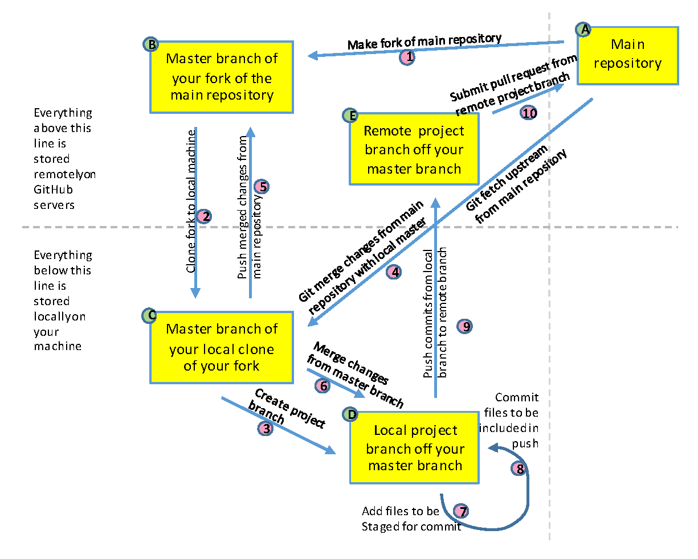

(chap_workflow)=
# Git and GitHub Collaborative Workflow

Git and GitHub can be a lot to wrap one's head around at the beginning.  There's a lot of new jargon and one can get lost thinking about the various places that version of the files of kept (locally, in the `origin` repo, in the `upstream` repo).  To help with this, we'll step through the typical GitHub workflow followed by most projects in the Policy Simulation Library.  Throughout this, we'll reference the diagram below, which provides a visual representation of the GitHub workflow described. 

We begin assuming that you have installed and configured Git on  your machine and setup a GitHub account.  Now assume that you want to start working with a project at `https://github.com/PSLmodels/project`.  The step-by-step approach to this is as follows:

1. Make a fork of the main repository.  To do this, you navigate to the GitHub repository of the project, `https://github.com/PSLmodels/project` and click "Fork" in the top right of the screen.  Select the destination for the fork (which you will probably want to be your GitHub profile).  This will create a copy of the project on the Internet at `https://github.com/yourname/project`.  We will refer to `https://github.com/PSLmodels/project` as the "upstream" repository and your fork, `https://github.com/yourname/project`, as the "origin" repository.
2. Make a copy of the new fork on your local machine.  To do this, you will click on the green "Code" button on the webpage of your fork.  Copy that url that is shown there.  Next, open your command prompt/terminal on your computer and navigate to a directory where you would like to save this repository.  Once there, type `git clone https://github.com/username/project.git`, where the url is what you just copied and pasted into your terminal.  Hit "return" and you will see the files being downloaded onto your computer into a new folder called `project`.  Now you have a copy of all the files for the project on your computer and are ready to work with them.
3. Once ready to start editing files, we'll want to create a new branch to work on.  Note that once you cloned the repository, one branch was created, this one is called `master` (or `main`).  We want to keep the `master`/`main` branch synced to the upstream repository, ensuring that it has tested, working code.  We can create a new branch off of the `master` branch by (1) ensuring we are on the `master` branch with the command `git checkout master` and then (2) checking out a new branch with `git checkout -b new_branch_name`.
4. If sometime has gone by since we got files from the upstream branch, we can check to make sure we have the latest files by doing a `git fetch upstream`.
5. After fetching the changes, we can add them to our local files with the command `git merge upstream/master`.
6. If changes were found, we can also sync our remote fork with a `git push origin branch_name`.
7. Once we make edits to local files, we will want to add our changes to the Git history.  We do this by `git add path/filename`.
8. After adding our changes to the history, we will want to commit them so that they are included in our next push to the remote repository.  Do this by `git commit path/filename`.
9. When we have made some set of changes, we may want to push them to our remote fork to (1) back them up, (2) more easily share them with others, and/or (3) to set up a Pull Request to change the code in the upstream repository.  Do do this, we'll do `git push origin new_branch_name`.
10. After we've made all the changes we want to the code base (which may entail cycling through steps 4-9 several times), we will want to open a pull request.  The easiest way to do this is to navigate to the upstream repo at `https://github.com/PSLmodels/project`, then click on the "Pull requests" tab.  If you have pushed your changes to your origin, you should see a green button that says "Compare & pull request".  Click then to open a pull request.  Enter a descriptive title and more description in the dialogue box below. This will help project maintainers understand and review your code changes.  If everything looks good, it'll get merged into the code base.  If not, maintainers will offer helpful feedback to address any issues and you can revise the code by committing and pushing new changes as in steps 7-9.

