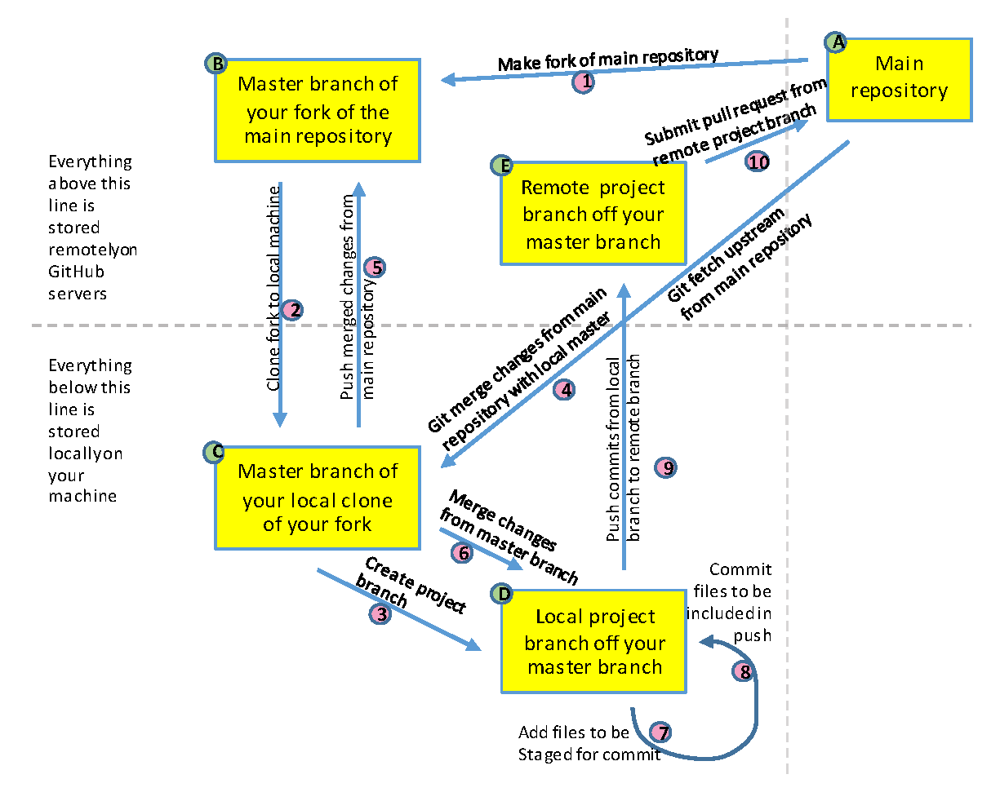

(chap_workflow)=
# Git and GitHub Collaborative Workflow

Git and GitHub can feel confusing at first because you are managing changes in more than one place at the same time: your working files, your local Git history, your fork on GitHub, and the main repository maintained by a project. The goal of this chapter is to slow that process down and show the standard fork-and-pull-request workflow used by many repositories in the Policy Simulation Library (PSLmodels) organization.

Throughout this chapter, we refer to the main project repository as `upstream` and your personal fork as `origin`.



## The workflow at a glance

In most PSLmodels repositories, a new contributor follows this cycle:

1. Fork the upstream repository on GitHub.
2. Clone the fork to your computer.
3. Add the upstream repository as a second remote.
4. Keep your local `main` branch synchronized with `upstream/main`.
5. Create a feature branch for your work.
6. Make changes, stage them, and commit them locally.
7. Push the branch to your fork on GitHub.
8. Open a pull request from your branch to the upstream repository.
9. Respond to review comments by adding more commits to the same branch.
10. After the pull request is merged, update your local `main` branch and delete the temporary feature branch.

## Step 1: Fork the main repository

Suppose you want to contribute to `https://github.com/PSLmodels/project`.

Go to that repository on GitHub and click the "Fork" button. GitHub will create a copy of the repository under your own account, for example:

* upstream repository: `https://github.com/PSLmodels/project`
* your fork: `https://github.com/yourname/project`

Your fork gives you a place where you can push branches even if you do not have direct write access to the upstream repository.

## Step 2: Clone your fork

Open a terminal and move to a directory where you want the project to live. Then clone your fork:

```bash
git clone https://github.com/yourname/project.git
cd project
```

At this point, Git has already created one remote for you:

```bash
git remote -v
```

That remote is usually named `origin`, and it points to your fork.

## Step 3: Add the upstream remote

Because you cloned your fork rather than the main PSLmodels repository, you still need to tell Git where the upstream project lives:

```bash
git remote add upstream https://github.com/PSLmodels/project.git
git remote -v
```

After this, you should see both `origin` and `upstream`.

```{admonition} Why this matters
:class: note
Beginners often think `origin` is a special word that means "the main repository." It does not. `origin` is simply the default name Git gives to the remote you cloned from. In a fork-based workflow, `origin` is usually your fork and `upstream` is the main project repository.
```

## Step 4: Keep local `main` synchronized with upstream

Before starting new work, update your local `main` branch so that it matches the latest tested code from the main project.

```bash
git checkout main
git fetch upstream
git merge upstream/main
git push origin main
```

Some older repositories may still use `master` instead of `main`. If so, replace `main` with `master` in the commands above.

Many contributors prefer `git pull --ff-only upstream main` instead of separate `fetch` and `merge` commands. Both approaches are fine once you understand what they do. We separate them here because it makes the sequence easier to understand.

## Step 5: Create a feature branch

Do not work directly on `main`. Create a branch for the change you want to make:

```bash
git checkout -b fix-typo-intro
```

Choose a branch name that briefly describes the task. Good names make it easier for reviewers and for your future self to understand what the branch is for.

## Step 6: Edit, inspect, stage, and commit

Now make your changes in the files you want to update. While working, use `git status` often:

```bash
git status
```

When you are ready to record part of your work, stage the relevant file changes:

```bash
git add path/to/file
```

Then commit the staged changes:

```bash
git commit -m "Clarify glossary definitions for branch and commit"
```

You can repeat the cycle of edit, `git add`, and `git commit` as many times as needed.

```{admonition} A commit records staged changes
:class: tip
The most common beginner mistake here is to think that `git commit` takes a file path. Normally it does not. First stage files with `git add`, then create the commit with `git commit -m "message"`.
```

## Step 7: Push the branch to your fork

Once your branch contains commits you want backed up or reviewed, push it to your fork:

```bash
git push origin fix-typo-intro
```

The first time you push a new branch, GitHub will usually show a banner offering to open a pull request.

## Step 8: Open a pull request

Open the pull request from your branch on your fork to the upstream repository's main branch.

In practice, this usually means:

* base repository: `PSLmodels/project`
* base branch: `main`
* compare repository: `yourname/project`
* compare branch: `fix-typo-intro`

Write a PR title that states the change clearly. In the description, explain:

* what you changed
* why you changed it
* anything a reviewer should pay special attention to

If the repository has a PR template, fill it out carefully. That template usually reflects the maintainers' expectations.

## Step 9: Respond to review and CI feedback

Opening the pull request is not the end of the process. In most collaborative repositories, three things happen next.

### Review comments

Maintainers or other contributors may ask questions or request revisions. Make those changes locally on the same branch, then commit and push again:

```bash
git add path/to/file
git commit -m "Address PR feedback on workflow example"
git push origin fix-typo-intro
```

The pull request updates automatically.

### Automated tests

Many repositories run continuous integration checks on every pull request. These checks might run unit tests, style checks, builds, or documentation validation. If a CI check fails, inspect the failure and update your branch until the checks pass.

### Keeping the branch current

If the upstream repository changes while your PR is open, you may need to update your branch:

```bash
git checkout main
git fetch upstream
git merge upstream/main
git checkout fix-typo-intro
git merge main
```

More advanced contributors may prefer rebasing here, but merging `main` into your feature branch is often simpler for beginners.

## Step 10: After the pull request is merged

Once your PR is merged, clean up your local repository.

First, update your local `main` branch:

```bash
git checkout main
git fetch upstream
git merge upstream/main
git push origin main
```

Then delete the feature branch locally:

```bash
git branch -d fix-typo-intro
```

You can also delete the branch from your fork on GitHub, either through the GitHub interface or with:

```bash
git push origin --delete fix-typo-intro
```

## What PSLmodels-style workflow is trying to protect

This workflow may seem elaborate for a one-line fix, but each part serves a purpose.

* Forks let anyone propose changes without giving everyone write access to the main repository.
* Branches isolate one task from another.
* Pull requests create a clear place for review and discussion.
* CI checks help catch bugs before they reach the default branch.
* Keeping `main` clean ensures you always have a reliable branch to build from.

Those safeguards are especially valuable in research and policy-model repositories, where code, documentation, and results often need to be reproducible and carefully reviewed.

## Common beginner mistakes

The following problems happen often and are normal parts of learning Git.

* Working directly on `main` instead of a feature branch.
* Forgetting to add the `upstream` remote.
* Committing too many unrelated changes together.
* Pushing to the wrong branch.
* Opening a PR from `main` instead of from the feature branch.
* Trying to fix a failed CI check on GitHub without reproducing the problem locally.

The next chapters cover some of these topics in more detail, especially merge conflicts and pull request discussions.
